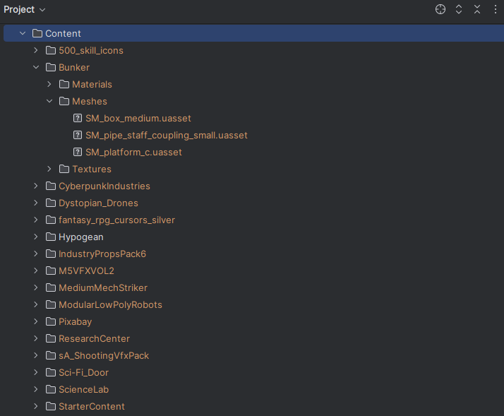
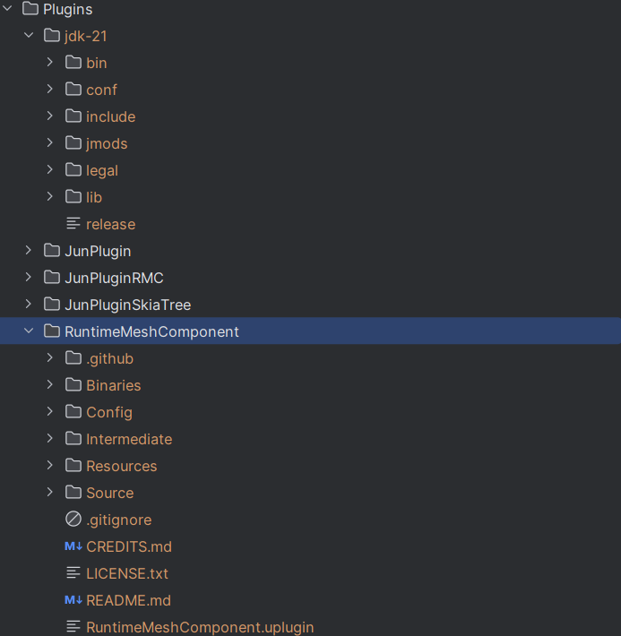

# About
The aim of this project was to create a X-COM like, round based, tactical game. The project is written in Kotlin and 
uses the Unreal engine via JNI. The UI elements are integrated by using a dll that was created by 
Plugins/JunPluginSkiaTree in Rust. This Rust plugin is based on [Skia](https://skia.org/).

Currently, the first level is playable. You can see gameplay footage here:

[](https://www.youtube.com/watch?v=zQCUxmKPHQM)

The game has been developed over several years by a friend of mine and me. But this last year it has been only me,
and I realize it's too much for me alone. I'm good with stopping here, and anyone is welcome to build upon this
code base and continue the development. There are still a lot of FIXME / TODO comments in the code, which I'll leave
to show open ideas.

The working title of this project has been Hypogean, the actual game title is Ascent of Bot.

# Unreal / Pixabay assets
I may not redistribute most of the assets I used in this project.
If you want to run the project, you have three options:
1. Use your own assets and replace references in the code correspondingly.
2. Obtain the assets (see Credits section below). Some of them are free.
3. Remove references to assets you don't want to use.

A list of the exact assets used can be found in [KotlinAssets](Content/Hypogean/AssetInclusion/KotlinAssets.lst).
When you obtain all the assets used in the project the Content folder structure should look like this:



# Setup
1. Install Epic games launcher and Unreal Engine 5.1
2. Download JDK 21 and install it to Plugins\jdk-21
3. Download [RuntimeMeshComponent](https://github.com/TriAxis-Games/RealtimeMeshComponent/tree/RMC4.5_dev) and copy it to Plugins\RuntimeMeshComponent
4. After steps 2 and 3, the plugin folder structure should look like this:

   
5. Install [rustup](https://rustup.rs/) and execute ```rustup toolchain install nightly```
6. In ```Plugins\JunPluginSkiaTree\skia-tree``` execute ```cargo build```
7. Install Visual Code 2022 with Unreal und .Net properties.
8. Build the project with the following commands:
```
gradle build
gradle core:createJunConfigXml
```
9. Open the Unreal project [Hypogean](Hypogean.uproject).
10. The Unreal editor will ask you if the plugins should be recompiled. Click "Yes" and be patient. If you are wondering what's going on 
   check the logs in Saved\Logs\Hypogean.log

# Packaging
1. Execute main method in ```tools/src/main/kotlin/com/cerebrallychallenged/hypogean/build/ScanAssetRefs.kt```
2. In the Unreal Editor, open asset Content/Hypogean/AssetInclusion/SourceAssets, click on "Update Asset List", save.
3. Execute main method in ```tools/src/main/kotlin/com/cerebrallychallenged/hypogean/build/Packaging.kt```
4. The created files can be found in ```Saved\StagedBuilds\Windows```

# Creating UI elements using the GIMP python API
Download [Gimp version 2.10.x](https://download.gimp.org/gimp/v2.10/) and install it to ```tools/GIMP 2```, while
leaving the files / folders that already exist in this folder as is. In order to create action buttons, you must start 
```tools/GIMP 2/bin/gimp-2.10.exe``` once manually. Then close the gimp application once it has fully loaded.
After that, you can execute the main method in 
```tools/src/main/kotlin/com/cerebrallychallenged/hypogean/graphics/buttons/CreateActionButtons.kt```
to generate action buttons starting from a given SVG in the folder gui-graphics/icons.
The following classes have been used to create the UI elements used in the game:
* [CreateActionButtons](tools/src/main/kotlin/com/cerebrallychallenged/hypogean/graphics/buttons/CreateActionButtons.kt)
* [CreateFunctionButtons](tools/src/main/kotlin/com/cerebrallychallenged/hypogean/graphics/buttons/CreateFunctionButtons.kt)
* [CreateSlider](tools/src/main/kotlin/com/cerebrallychallenged/hypogean/graphics/buttons/CreateSlider.kt)
* [CreateStandardButtons](tools/src/main/kotlin/com/cerebrallychallenged/hypogean/graphics/buttons/CreateStandardButtons.kt)
* [SliceIniFrame](tools/src/main/kotlin/com/cerebrallychallenged/hypogean/graphics/slicing/SliceIniFrame.kt)
* [SliceInventoryBox](tools/src/main/kotlin/com/cerebrallychallenged/hypogean/graphics/slicing/SliceInventoryBox.kt) 
* [SliceViewFrame](tools/src/main/kotlin/com/cerebrallychallenged/hypogean/graphics/slicing/SliceViewFrame.kt)

# Credits
For button icons from https://game-icons.net:
* [lorc](https://lorcblog.blogspot.com/)
* [Delapouite](https://delapouite.com/) 
* [sbed](https://opengameart.org/content/95-game-icons)
* Skoll etc.

For game icons:
* [500-skill-icons](https://poneti.artstation.com/store/J0kW/500-skill-icons) from [Poneti](https://poneti.artstation.com/)

For Unreal assets:
* [Bunker](https://www.fab.com/listings/8322737f-c90f-4c04-af40-9b84e7e672a2) from [Starlight Arts](https://starlight-arts.com/)
* [CyberpunkIndustries](https://www.fab.com/listings/b9266683-47f1-4905-a8e8-e605188bd50c) from [Softkick Game Studio](https://www.fab.com/sellers/Softkick%20Game%20Studio)
* [Dystopian_Drones](https://www.fab.com/de/listings/e3fddf65-8fce-4c0c-8b47-819aac77e473) from [Shapeforms Audio](https://www.fab.com/de/sellers/Shapeforms%20Audio)
* [Industry Props Pack 6](https://www.fab.com/listings/b5603e44-e1b0-4346-9c3d-04887aa9f87d) from [Silver Tm](https://www.fab.com/sellers/SilverTm)
* [M5 VFX Vol2. Fire and Flames](https://www.fab.com/listings/c5b0270a-a295-4644-a4be-42cb1e56a197) from [M5VFX](https://www.fab.com/sellers/M5VFX)
* [Modular Low Poly Robots](https://www.fab.com/listings/a33ede7d-5be6-4d68-90c1-a8ee8403089c) from [UDev Lemon](https://www.fab.com/sellers/UDevLemon)
* [ResearchCenter](https://www.fab.com/listings/6bb72326-8122-4f18-a698-a2bb877074e8) from [Tris Games](https://www.fab.com/sellers/Tris%20Games)
* [Shooter VFX Bundle](https://www.fab.com/listings/177366a4-225f-497c-83e9-147a86450682) from [Jil3RGames](https://www.fab.com/sellers/Jil3RGames)
* [Science Laboratory](https://www.fab.com/listings/b07022ea-ff07-4c16-8a32-c84914213d74) from [Silver Tm](https://www.fab.com/sellers/SilverTm)
* [Medium Mech Striker](https://www.fab.com/listings/a40b3d01-c090-4036-ac49-e4c538ecd436) from [MSGDI](https://www.fab.com/sellers/MSGDI)
* [Fantasy RPG Cursors](https://www.fab.com/listings/370b30f9-52a0-4015-85ad-bdcb1f6b4ec9) from [Leonid Deburger](https://www.fab.com/sellers/Leonid%20Deburger)
* [Sci-Fi Door](https://www.fab.com/listings/07e9a972-ceac-4ba9-84cc-e17b3c1b4f22) from [nete.cakmak](https://www.fab.com/sellers/nete.cakmak)
* [StarterContent](https://dev.epicgames.com/documentation/en-us/unreal-engine/starter-content-in-unreal-engine?application_version=5.1) from [Unreal](https://dev.epicgames.com)

For weapon sounds:
* [Pixabay](https://pixabay.com/)


